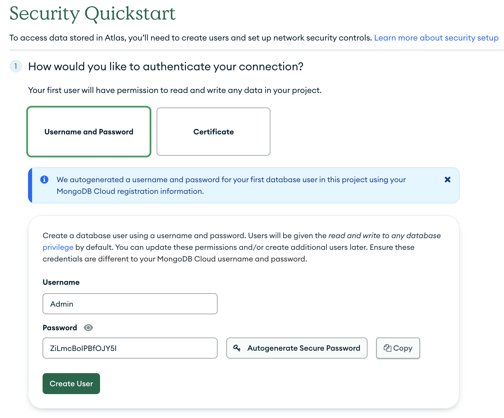

## Objective 1: Diving into MongoDB

### What is MongoDB?

MongoDB is a document-oriented NoSQL database. It stores data in flexible, JSON-like documents, meaning fields can vary from document to document and data structure can be changed over time. This provides the ability to store, query, and process large amounts of data in myriad ways.

### Setting up MongoDB

First, you'll need to sign up for a [free MongoDB account](https://www.mongodb.com/).

Then you'll need a MongoDB project.

- Create new project and give it a name.

- As the owner, you'll automatically be added as a user. Click `Create Project`.

- Click `Build a Database`

- Choose an `M0` free tier database. Choose a hosting provider - AWS, Google or Azure. For best performance, select a region close to you. Make sure it says `FREE` and click `Create`.

- Create a username and password for your database. Click `Create User`. Be sure to save this username & password, we will need it later.

- Your current IP address will be automatically added. Add additional IPs as needed.

- Click `Finish and Close`, then click `Go To Database`.

- Click `Connect`, then click `Drivers`.

- Copy your connection string. You'll need to replace `<password>` with the password we created in a previous step.
- Save your connection string to a file called `.env` at the root of the project.
  - ```MONGODB_URL=mongodb+srv://Admin:<password>@cluster0.gyyzea9.mongodb.net/?retryWrites=true&w=majority```

Once MongoDB is set up, you can interact with it using PyMongo.

### What is PyMongo?

PyMongo is a Python driver for MongoDB. It provides tools to work with MongoDB, allowing you to interact with MongoDB databases within your Python programs.

First, you need to install PyMongo with the command:

```bash
pip install python-dotenv fastapi pymongo
```

Then, you can connect to your MongoDB instance and perform various operations:

### PyMongo Basic

```python
import os
from pymongo import MongoClient
from dotenv import load_dotenv

# load the environment variables from the `.env` file
load_dotenv()

# create a MongoClient to interact with your MongoDB instance
db_url = os.getenv("MONGODB_URL")
client = MongoClient(db_url)

# get a reference to your database
db = client['mydatabase']

# get a reference to your collection
collection = db['mycollection']

# insert a document into the collection
collection.insert_one({
  "name": "John Smith", 
  "age": 30, 
  "job": "developer",
  "favorite_language": "Python",
})

# find a document in the collection
document = collection.find_one({"favorite_language": "Python"})

print(document)

```

## Additional Resources
- [MongoDB](https://www.mongodb.com)
